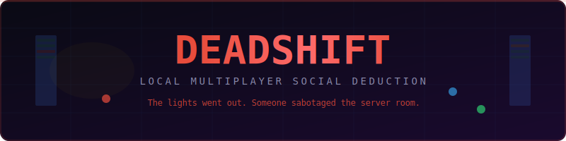
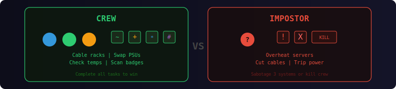
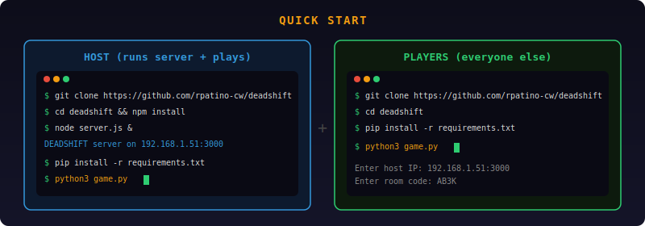
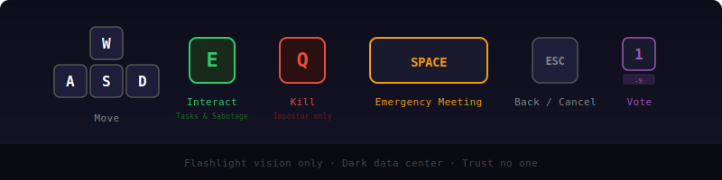

<p align="center">
  
</p>

<p align="center">
  
  
  
  
  
</p>

<p align="center">
  <b>Among Us meets the data center.</b><br/>
  One person hosts. Everyone joins on the same WiFi. No accounts, no internet required.
</p>

---

> ### Just want to play? Your host will text you a server IP. Then:
> ```bash
> git clone https://github.com/rpatino-cw/deadshift.git
> cd deadshift
> bash play.sh
> ```
> **Windows?** Double-click `play.bat` instead. That's it. It installs everything for you.

---

## How It Works

<p align="center">
  
</p>

## The Roles

<p align="center">
  
</p>

**Crew** — Complete tasks at stations around the dark data center. Cable racks, PSU swaps, cooling checks, badge scans. Finish them all to win.

**Impostor** — Blend in. Sabotage critical systems. Eliminate crew in the dark. Win by sabotaging 3 systems or outnumbering the crew.

**Everyone** — Limited flashlight vision. You can only see what's near you. Call emergency meetings to discuss and vote someone out.

---

## Quick Start

<p align="center">
  
</p>

### Host (runs the server + plays)
```bash
git clone https://github.com/rpatino-cw/deadshift.git
cd deadshift
bash play.sh host
```
That's it. It installs deps, starts the server, prints your IP, and opens the game.

### Players (everyone else)
```bash
git clone https://github.com/rpatino-cw/deadshift.git
cd deadshift
bash play.sh
```
Enter the server IP your host gives you + the room code. **Windows?** Double-click `play.bat`.

> **Requirements:** Python 3.10+ (all players). Node.js 18+ (host only). Same WiFi.
> Everything else installs automatically on first run.

---

## Controls

<p align="center">
  
</p>

| Key | Action |
|-----|--------|
| `WASD` | Move around the data center |
| `E` | Interact — do tasks, sabotage, or hit the meeting button |
| `Q` | Kill a nearby crew member *(impostor only)* |
| `SPACE` | Call emergency meeting |
| `1-9` | Vote for a player during meetings |
| `0` | Skip vote |
| `ESC` | Cancel task / back to menu |

---

## Game Features

```
  DARK DATA CENTER          FLASHLIGHT VISION         TASK MINIGAMES
  ┌──────────────┐         ┌──────────────┐         ┌──────────────┐
  │ ░░░░████░░░░ │         │    ╭────╮    │         │ ■──────────■ │
  │ ░░░░████░░░░ │         │   ╱      ╲   │         │ ■──────────■ │
  │ ░░██    ██░░ │         │  │  ●  ●  │  │         │ ■──────────■ │
  │ ░░██    ██░░ │         │   ╲      ╱   │         │ ■──────────■ │
  │ ░░░░████░░░░ │         │    ╰────╯    │         │ [CONNECTED]  │
  └──────────────┘         └──────────────┘         └──────────────┘

  SABOTAGE SYSTEM           EMERGENCY MEETINGS        VOTE & EJECT
  ┌──────────────┐         ┌──────────────┐         ┌──────────────┐
  │  ╔══════╗    │         │ Red: "Not me" │         │ ● Red    [3] │
  │  ║ !ERR ║    │         │ Blu: "Where?" │         │ ● Blue   [1] │
  │  ║ OVHT ║    │         │ Grn: "Rack B" │         │ ● Green  [0] │
  │  ╚══════╝    │         │ Ylw: "sus"    │         │ ● Skip   [1] │
  │  [CRITICAL]  │         │               │         │ Red ejected! │
  └──────────────┘         └──────────────┘         └──────────────┘
```

### Win Conditions

| Side | Win by... |
|------|-----------|
| **Crew** | Completing all tasks OR voting out the impostor |
| **Impostor** | Sabotaging 3 critical systems OR outnumbering crew |

---

## Admin / QA Mode

Solo testing with full control:

```bash
python3 game.py --admin
```

| Key | Action |
|-----|--------|
| `F1` | Toggle admin panel |
| `F2` | Switch role (crew / impostor) |
| `F3` | Toggle fog of war |
| `F4` | God mode (no proximity limits) |
| `F5` | Spawn 3 bots |
| `F6` | Force emergency meeting |
| `F7` | Skip all tasks (crew win) |
| `F8` | Force crew win |
| `F9` | Force impostor win |
| `F10` | Teleport to center |

---

## Tech Stack

| Component | Tech |
|-----------|------|
| Server | Node.js + Socket.io — rooms, game state, 20 tick/sec sync |
| Client | Python + Pygame + python-socketio |
| Network | WebSocket over LAN — same WiFi, no internet |
| Players | 3-8 per room, 1-2 impostors |

## Requirements

- **Node.js** 18+
- **Python** 3.10+
- **Same WiFi** network for all players

---

<p align="center">
  <sub>Built with Pygame + Socket.io. No accounts. No telemetry. Just betrayal.</sub>
</p>
